
# COMP2150 - Level Design Document
### Name: Geng-Yu Lin
### Student number: 45951578

## 1. Player Experience (~700 words)

### 1.1. Discovery
My game follows a difficulty curve of having an easy level at the beginning and increasing the difficulty as the game continues in further levels, with the last level being the most difficult and requiring the player to make use of the skills they have discovered and learned in previous levels. The first level contains no dangerous encounters except a single spike for the player to jump over.
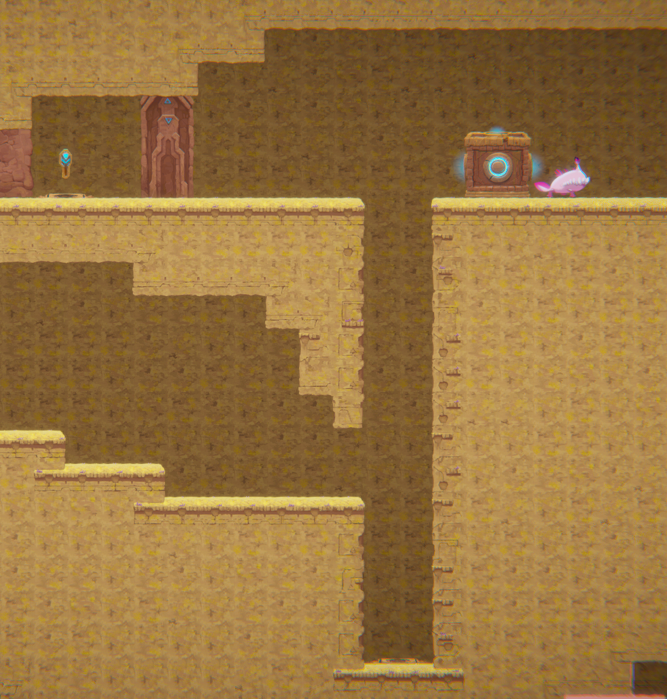
The player will further discover new verbs to solve encounters such as jumping and ducking under spikes on a moving platform, to later pushing a box into a hole with a pressure pad to open a door in the second level. The player also learns new verbs making use of the staff and gun when acquiring them in the second and third level respectively.

### 1.2. Drama
The game follows a medium-paced intensity curve, with moments of tension and relief placed strategically to keep the players engaged with the game. The player begins with initial relative relief as the first level is only to have the player be used to the level style that will be used in later levels.

The first hook comes from when the player is transitioning to the second level, where the player must jump across pillars on a moving platform atop of acid. Other encounters increase tension throughout the second level, with the tension rising after each encounter as failing these encounters results in a large loss of progress.
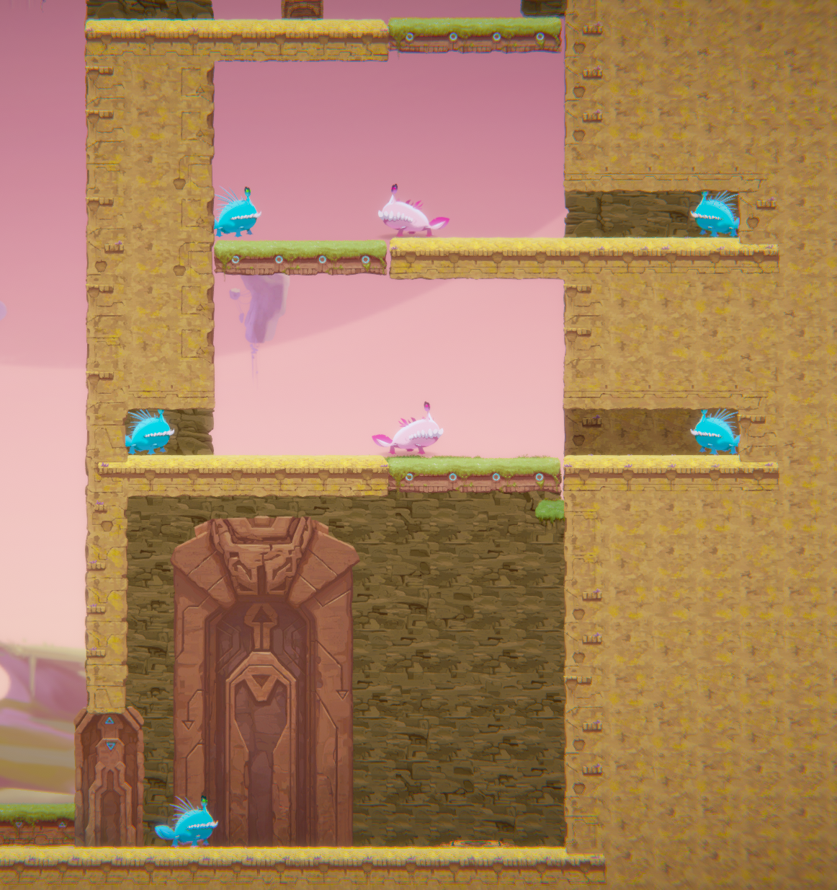
The final climax of the intensity curve is reached in the third level when the player must defeat a large amount of enemies to reach the exit.

### 1.3. Challenge
The player is challenged with more difficult sections as the player progresses through the level. However, it is kept within limits in that it won't have players constantly trying again to complete the encounters, keeping the player in the flow with the gameplay. The player initially encounters spikes and acid platform jumping in the first level.
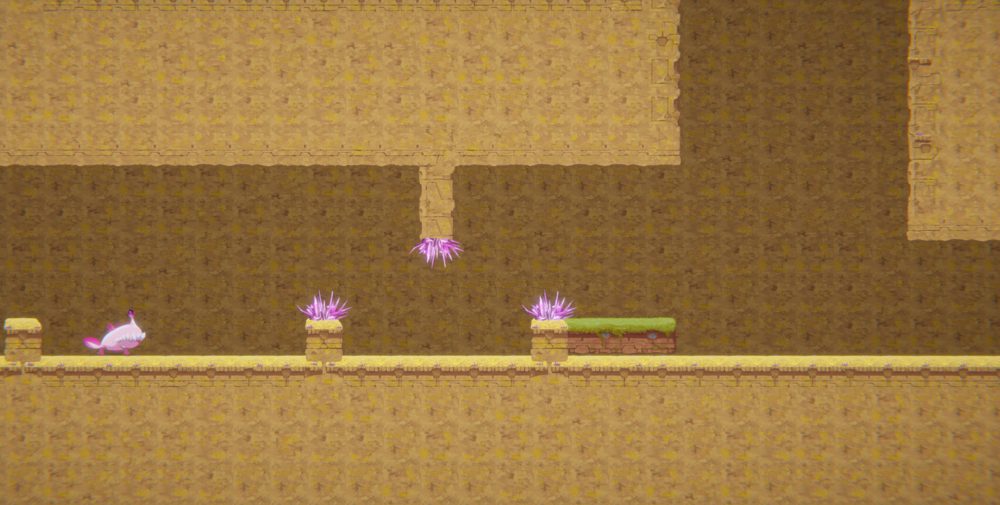
The player's first challenge comes in the second level when they need to step on a pressure pad to open a door. The player must combine what they learned in the first level to successfully jump and duck under the spikes to step on the pressure pad.

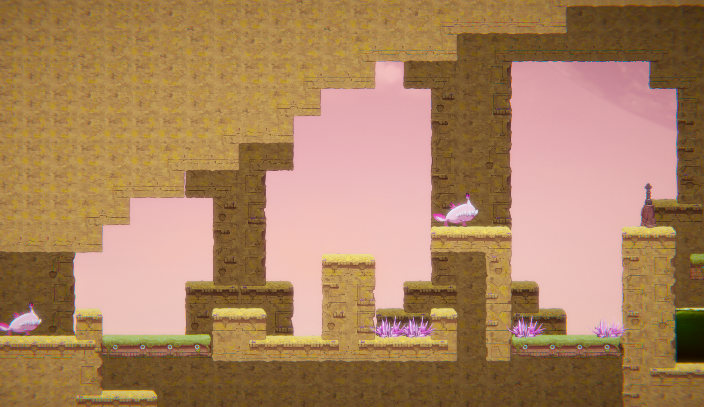
The next challenge comes after the player picks up the staff. The player will need to once again jump across platforms, however, there will be enemies on top of the platforms which must be defeated otherwise they will knock the player down onto the spikes below causing more damage taken.

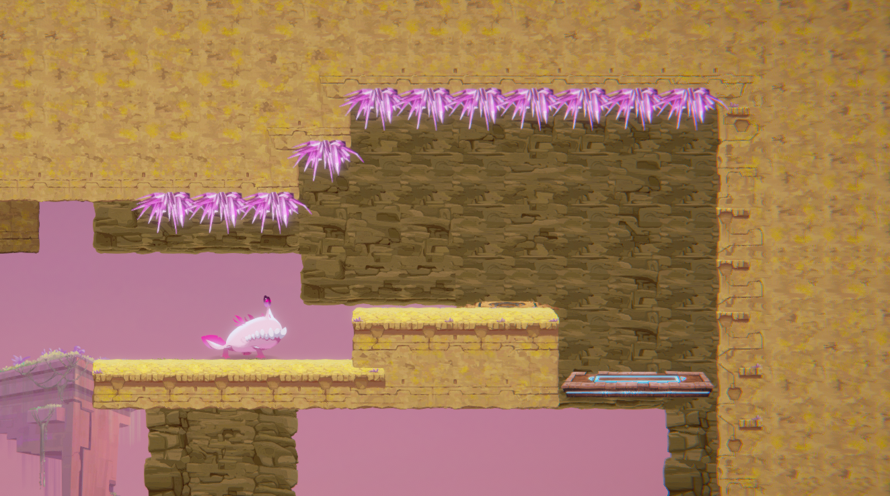
Afterwards, the player is met with another challenge as they enter the third level. The player must make use of what they learned in previous levels to once again jump and duck under spikes. The player also learns a new skill to control their jump height as jumping too high will result in getting hit by the spikes in the ceiling.

The final challenge comes in the encounter before the exit door. There is a mix of enemies on the way down to the door. There are blue enemies strategically placed in that they are unreachable by melee and can only be killed with a gun, forcing the player to make use of both their gun and melee to reach the exit.

### 1.4. Exploration
While my levels are mostly linear in terms of where to go for the next section, there are some aspects of exploration and aesthetic design for the player to see and explore in my levels. In the first section, there is very little background, allowing the player to see the beautiful background of the sky and planets before being exposed to a solid cave area in section two.
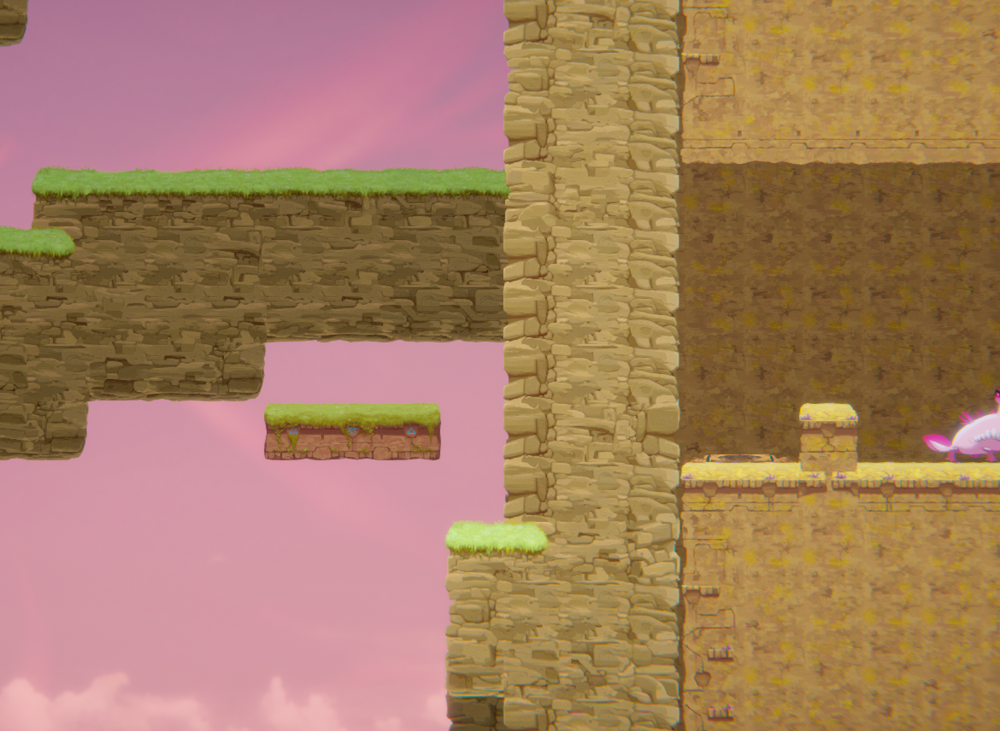
On the path upwards towards section two the player can see past the wall a pressure pad, hinting to the player there being something of interest there that they might want to go to later.

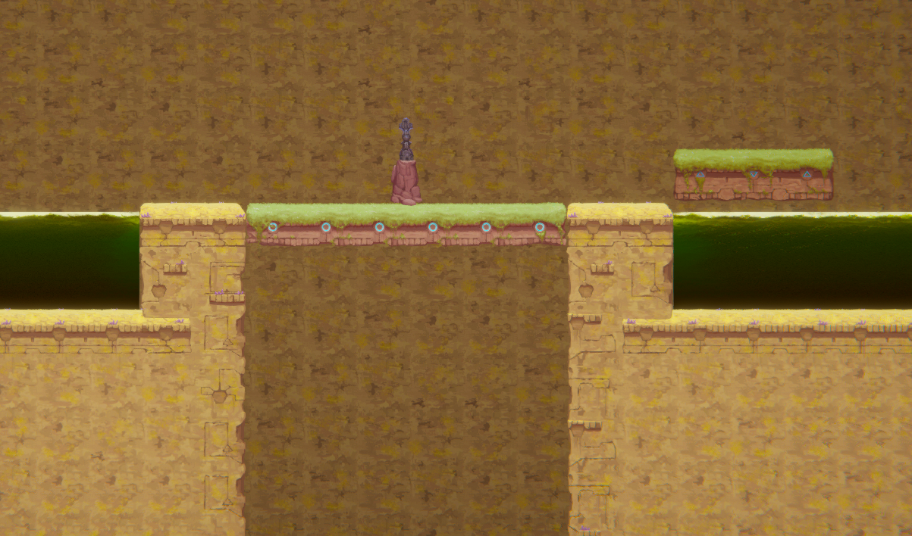
In the second section, the player is met with a split path of going down or right after reaching the middle of the acid area. The path towards the right is a one-way connective space from the end to the start of section two. Although the player can't progress going right, the player can see the location of the second key and remember its location. Going down instead there is once again another split path. If the player heads right first they will be met with a locked door that will require a pressure pad to open. The player will be reminded of the pressure pad they saw earlier and head left to open the door and continue through.

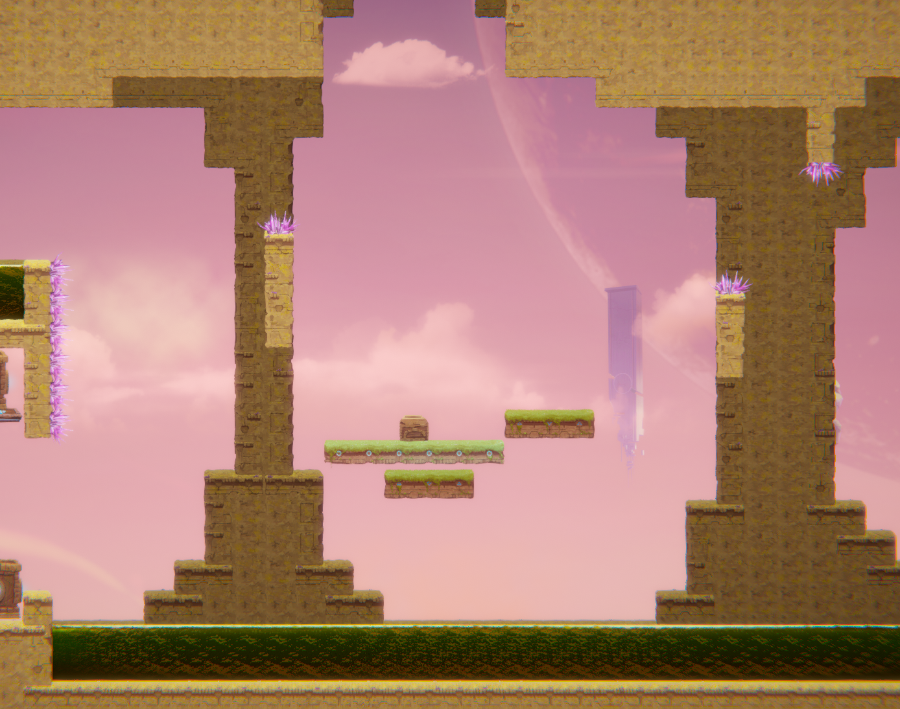
After the player drops to the third section the player is exposed to the background with large pillars as if holding the structure of section three up. The player is met again with a split path going bottom left or top right. Depending on the players' timing, they may also see a moving platform moving left and right on top of them.

## 2. Core Gameplay (~400 words)
A section on Core Gameplay, where storyboards are used to outline how you introduce the player to each of the required gameplay elements in the first section of the game. Storyboards should follow the format provided in lectures.

Storyboards can be combined when multiple mechanics are introduced within a single encounter. Each section should include a sentence or two to briefly justify why you chose to introduce the mechanic/s to the player in that sequence.

You should restructure the headings below to match the order they appear in your level.

### 2.1. Spikes
Spikes are introduced to the player first as spikes will be the most prevalent trap in the game, with it being used multiple times in different scenarios in further levels. The first spike shown to the player is easy to jump over and is used to prepare the player.

### 2.2. Moving Platforms
Moving platforms are next introduced to the player as it's the only long method of transport between two areas. These moving platforms pose no danger, however, in later levels players will need to jump/duck under obstacles to stay on the platform.

### 2.3. Keys
The first key is presented to the player close to the end of the level to indicate they are moving on the right path. The remaining keys are also placed near the end of levels so the player can get a sense of progression.

### 2.4. Acid
Acid is first shown to the player beginning in level 2. This initial encounter is not too dangerous but encounters later levels make use of acid as the floor to prevent players from traversing the level on the ground and skipping encounters.

### 2.5. Health Pickups
The player's first health pickup is midway through the second level, once the player has gone through some encounters earlier in the level. The box is to give the player some relief to let them know that health can be recovered.

### 2.6. Checkpoints
Each level contains one checkpoint and is placed just after a difficult or long encounter to prevent players from having to complete them again if they fall into acid.

### 2.7. Spitters
Spitters are initially introduced in level 2, however depending on player pathing, they may not encounter them until level 3 instead. Spitters are mainly used to block off encounters until they have acquired the gun, as they are placed in areas that are unkillable by staff.

### 2.8. Chompers
Players may alternatively first encounter the chompers instead. There is only one chomper the player encounters pre-staff to show the dangers of interacting with them, however soon after they will acquire the staff and be able to kill them.

### 2.9. Passthrough Platforms
Passthrough platforms are used to provide alternative pathways to go in my level, whether to continue past the platform or drop down. They are also used to move the player upwards from a lower ground.

### 2.10. Weapon Pickup (Staff)
The staff is given to the player in the middle of level 2, to provide them with a means to kill a chomper located on one of the platforms the player needs to jump across to proceed.

### 2.11. Weapon Pickup (Gun)
The gun is given to the player halfway through level 3, after some encounters that need to be cleared. The gun is the final item preventing the player from grabbing the third key and reaching the exit.

## 3. Spatiotemporal Design

### 3.1. Molecule Diagram
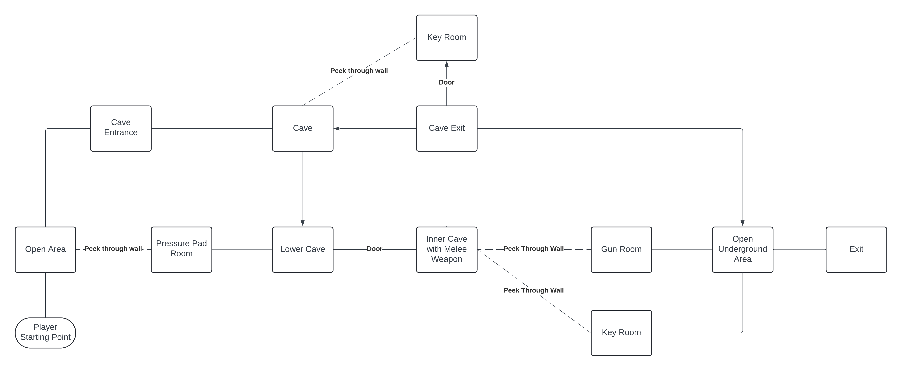

### 3.2. Level Map – Section 1
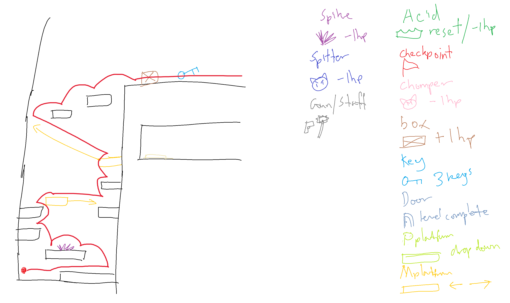

### 3.3. Level Map – Section 2
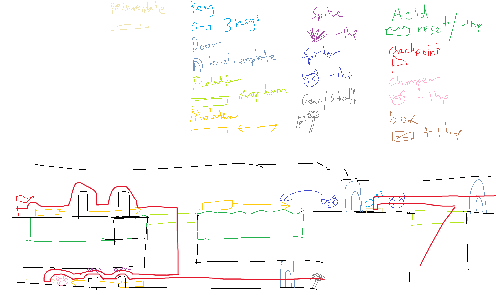
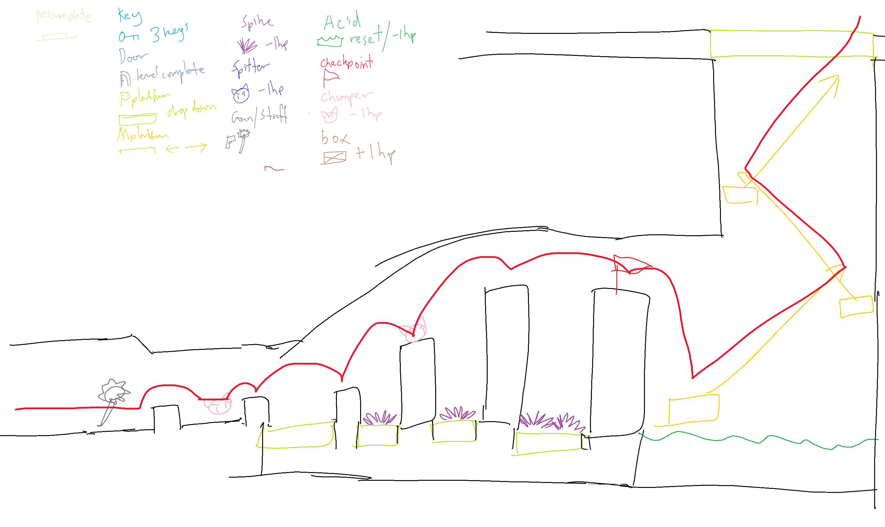

### 3.4. Level Map – Section 3
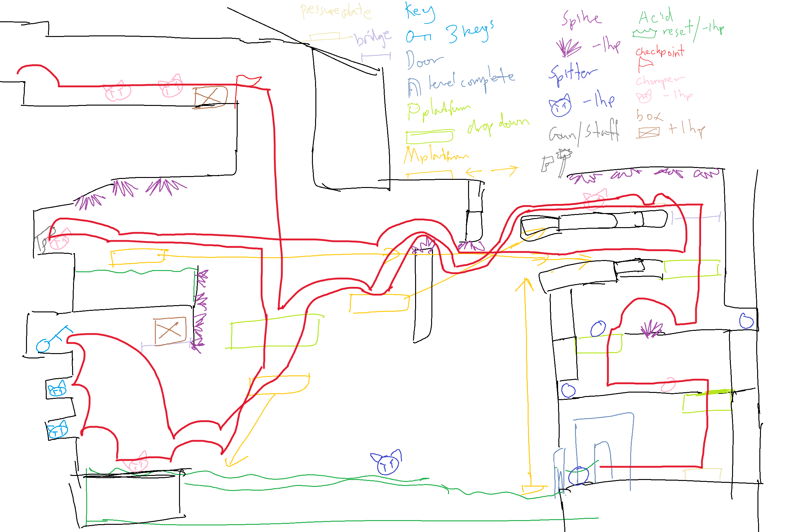

## 4. Iterative Design (~400 words)
Some initial level map drafts I planned for had changed due to limitations or differences in gameplay mechanics after testing in Unity. An example of this is the player's movement speed and jump height. The player can jump nearly 3x their height at seven blocks, whereas my initial level maps assumed the player could only jump their height. Due to this, many sections in my level had to be created with increased height to prevent players from jumping from platform to platform and skipping the encounters.
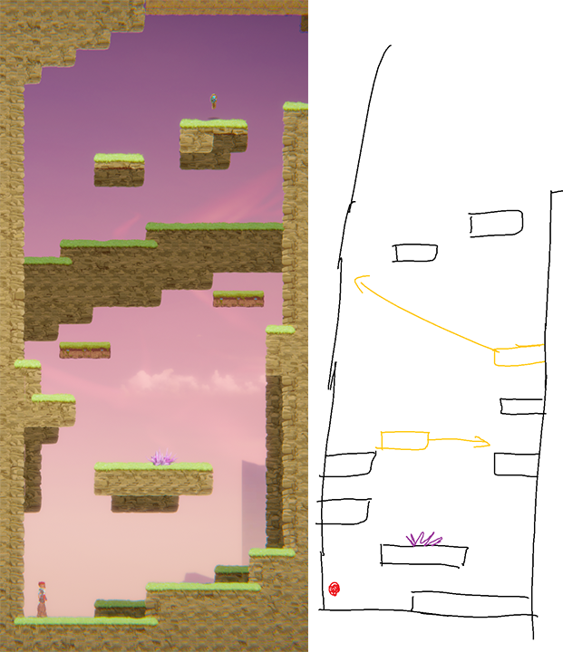

Playtesting also helped provide feedback on some parts of my levels that I didn't notice may have been too confusing or difficult to understand, particularly in the third level where there are multiple paths to take but an order in which to move around the level. One confusing part was the fact that stepping on the pressure pad on the top right would open not only the bridge next to it but also the bridge on the bottom left.
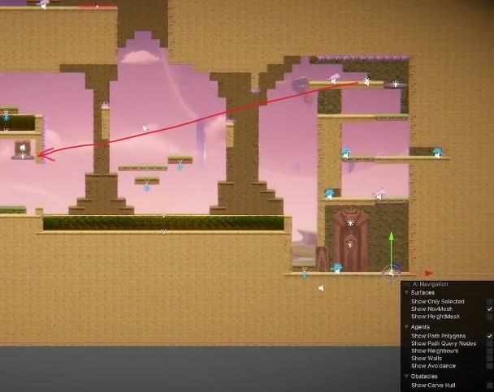

To resolve this issue a change was made to the design of the bottom left to have a box already on the floor, and once pushed into a hole in the floor, another box that can be pushed against the wall to jump up will appear.
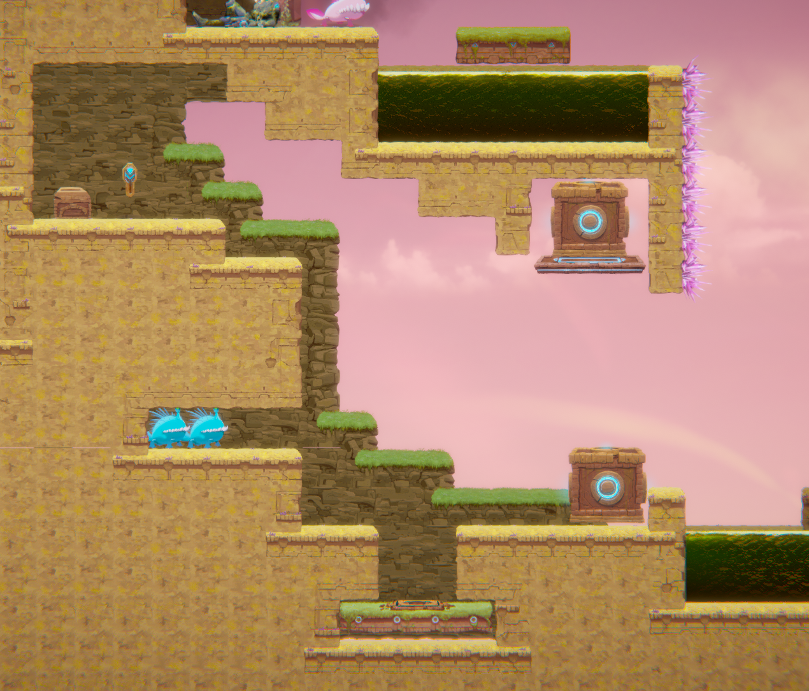

Another major change occurred in level 3 was the final ending encounter before the exit. The initial design featured only a downwards-moving platform that would move when the player lands on it to begin the final dropdown to the exit, but I couldn't have the platform only move once the player stands on it due to limitations of the game. Therefore, a redesign was made of the ending section to change to use multiple passthrough platforms instead.
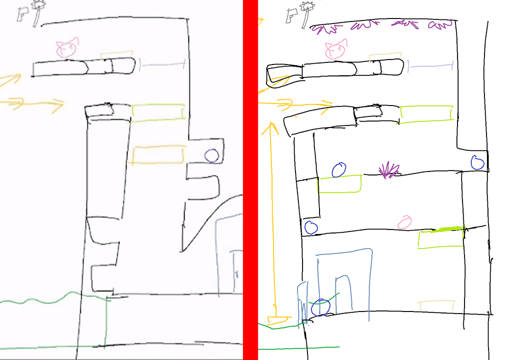

While most of the iteration changes above could be resolved fairly easily, one aspect I wish I could have further tested on was the whole level design in itself. Although the playtesters mentioned the game had a good flow, I feel the path the player takes to progress through the levels is too linear. Although there are encounters with alternative pathways, there is still only one correct way as the other would either lead to a dead end or contain an encounter that is needed to progress through the correct way. Further iterations of the level design of levels and connective spaces may have allowed for more better design of pathways for players to progress through.

## Generative AI Use Acknowledgement

### Tool Used: Grammarly
**Nature of Use**: Checking document correctness

**Evidence Attached?** Screenshot of Grammarly page with suggested document changes provided below and in file DocImages/ai1.png
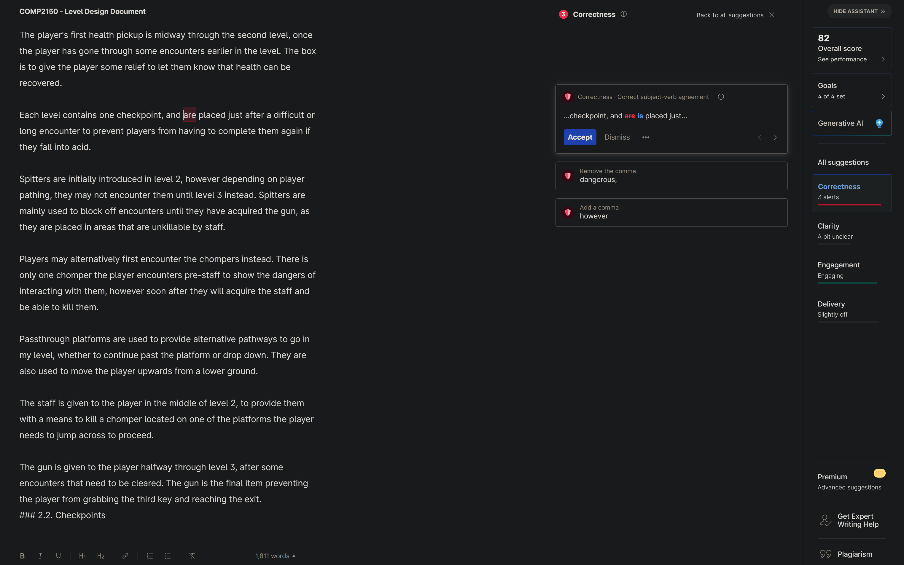

**Additional Notes:** Grammarly was used to simply check I didn't have any wording issues or incorrect tense/grammar used in my writing. As I don't have a premium subscription it is only used for basic document checking.

