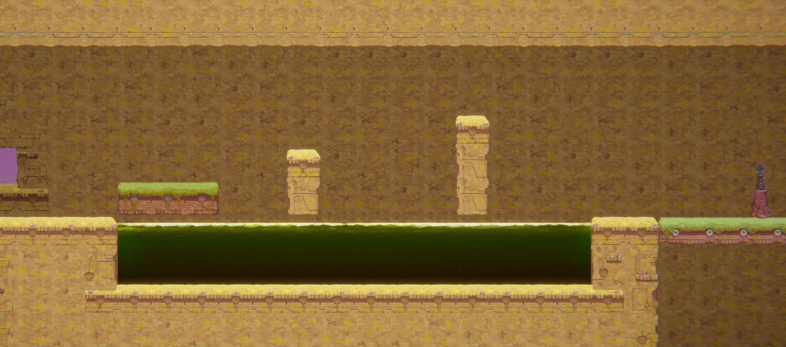

# COMP2150  - Level Design Document
### Name: Geng-Yu Lin
### Student number: 45951578

## 1. Player Experience (~700 words)

### 1.1. Discovery
My game follows a difficulty curve of having an easy level at the beginning and increasing the difficulty as the game continues in further levels, with the last level being the most difficult and requiring the player to make use of the skills they have discovered and learned in previous levels. The first level contains no dangerous encounters except a single spike for the player to jump over.

The player will further discover new verbs to solve encounters such as jumping and ducking under spikes on a moving platform, to later pushing a box into a hole with a pressure pad to open a door in the second level. The player also learns new verbs making use of the melee weapon and gun when acquiring them in the second and third level respectively.

### 1.2. Drama
The game follows a medium-paced intensity curve, with moments of tension and relief placed strategically to keep the players engaged with the game. The player begins with initial relative relief as the first level is only to have the player be used to the level style that will be used in later levels.

The first hook comes from when the player is transitioning to the second level, where the player must jump across pillars on a moving platform atop of acid. Other encounters increase tension throughout the second level, with the tension rising after each encounter as failing these encounters results in a large loss of progress.

The final climax of the intensity curve is reached in the third level when the player must defeat a large amount of enemies to reach the exit.

### 1.3. Challenge
The player is challenged with more difficult sections as the player progresses through the level. However, it is kept within limits in that it won't have players constantly trying again to complete the encounters, keeping the player in the flow with the gameplay. The player initially encounters spikes and acid platform jumping in the first level.

The player's first challenge comes in the second level when they need to step on a pressure pad to open a door. The player must combine what they learned in the first level to successfully jump and duck under the spikes to step on the pressure pad.

The next challenge comes after the player picks up the melee weapon. The player will need to once again jump across platforms, however, there will be enemies on top of the platforms which must be defeated otherwise they will knock the player down onto the spikes below causing more damage taken.

Afterwards, the player is met with another challenge as they enter the third level. The player must make use of what they learned in previous levels to once again jump and duck under spikes. The player also learns a new skill to control their jump height as jumping too high will result in getting hit by the spikes in the ceiling.

The final challenge comes in the encounter before the exit door. There is a mix of enemies on the way down to the door. There are blue enemies strategically placed in that they are unreachable by melee and can only be killed with a gun, forcing the player to make use of both their gun and melee to reach the exit.

### 1.4. Exploration
While my levels are mostly linear in terms of where to go for the next section, there are some aspects of exploration and aesthetic design for the player to see and explore in my levels. In the first section, there is very little background, allowing the player to see the beautiful background of the sky and planets before being exposed to a solid cave area in section two.

On the path upwards towards section two the player can see past the wall a pressure pad, hinting to the player there being something of interest there that they might want to go to later.

In the second section, the player is met with a split path of going down or right after reaching the middle of the acid area. The path towards the right is a one-way connective space from the end to the start of section two. Although the player can't progress going right, the player can see the location of the second key and remember its location. Going down instead there is once again another split path. If the player heads right first they will be met with a locked door that will require a pressure pad to open. The player will be reminded of the pressure pad they saw earlier and head left to open the door and continue through.

After the player drops to the third section the player is exposed to the background with large pillars as if holding the structure of section three up. The player is met again with a split path going bottom left or top right. Depending on the players' timing, they may also see a moving platform moving left and right on top of them.

## 2. Core Gameplay (~400 words)
A section on Core Gameplay, where storyboards are used to outline how you introduce the player to each of the required gameplay elements in the first section of the game. Storyboards should follow the format provided in lectures.

Storyboards can be combined when multiple mechanics are introduced within a single encounter. Each section should include a sentence or two to briefly justify why you chose to introduce the mechanic/s to the player in that sequence.

You should restructure the headings below to match the order they appear in your level.

### 2.1. Spikes
Spikes are introduced first to the player as spikes will be persistent throughout the whole game with it being used multiple times in different scenarios in further levels.

### 2.2. Moving Platforms
Moving platforms are next introduced to the player as it is the only method of transport between two distant areas. The initial moving platforms pose no danger as not much progress is lost if the player fails to jump onto the moving platform.

### 2.3. Keys
The key is next introduced to the player after they have successfully made the earlier jumps to indicate progression being made on the level. The remaining two keys are placed near the end of the level so the player is able to get an idea of how far in the game they are.

### 2.4. Health Pickups

### 2.5. Acid

### 2.6. Checkpoints

### 2.7. Spitters

### 2.8. Chompers

### 2.9. Passthrough Platforms

### 2.10. Weapon Pickup (Staff)

### 2.11. Weapon Pickup (Gun)

## 3. Spatiotemporal Design
A section on Spatiotemporal Design, which includes your molecule diagram and annotated level maps (one for each main section of your level). These diagrams may be made digitally or by hand, but must not be created from screenshots of your game. The annotated level maps should show the structure you intend to build, included game elements, and the path the player is expected to take through the level. Examples of these diagrams are included in the level design lectures.

No additional words are necessary for this section (any words should only be within your images/diagrams).
 
### 3.1. Molecule Diagram

### 3.2. Level Map – Section 1

### 3.3.	Level Map – Section 2

### 3.4.	Level Map – Section 3

## 4. Iterative Design (~400 words)
Reflect on how iterative design helped to improve your level. Additional prototypes and design artefacts should be included to demonstrate that you followed an iterative design process (e.g. pictures of paper prototypes, early grey-boxed maps, additional storyboards of later gameplay sequences, etc.). You can also use this section to justify design changes made in Unity after you drew your level design maps shown in section 3. 

You should conclude by highlighting a specific example of an encounter, or another aspect of your level design, that could be improved through further iterative design.

## Generative AI Use Acknowledgement

No AI tools were used in writing this documentation.

